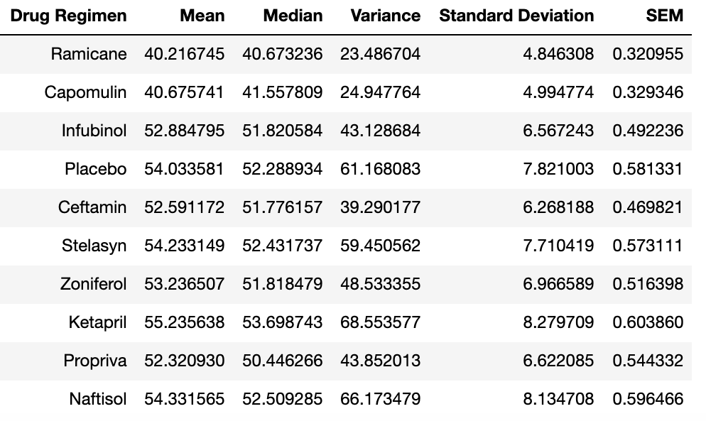

# Pymaceuticals
Analysis of Drug Regimens on Mice

For full analysis studied, and all charts requested, see the [Jupyter Notebook file](pymaceuticals.ipynb)

Data analysed comes from the CSV files in the [data](data/) folder.

## Observations and Insights

* There is a strong correlation between average tumor volume and mouse weight for mice that received the Capomulin regimen with the correlation coefficient equaling 0.84, which is higher than 0.7.
* Capomulin and Ramicane had the best overall results of the different drug regimens tested (their results were fairly similar overall).
* The remaining drug regimens tested had relatively similar results to the placebo, which therefore are unlikely considered effective treatments.

## Summary Statistics

## Boxplot of 4 Best Treatments

## Regression Model for Capomulin

## Line Plot for a Selected Mouse on Capomulin

